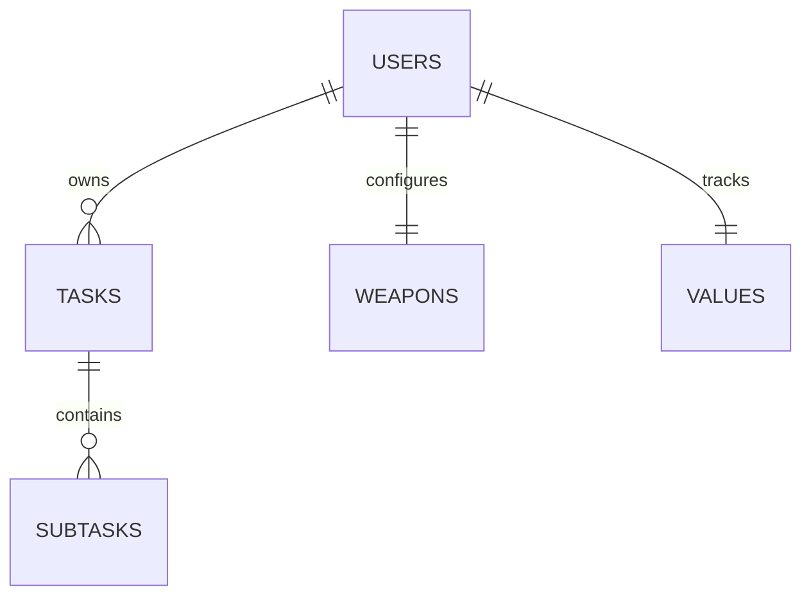

# TimeMaster: Database Schema & Entity Relationships

This document details the persistent storage schema, relationships, and data types used by the **TimeMaster** application both server-side (`db.json`) and client-side (`localStorage`).

---

## 🗄️ Database Entities & Structures

### 1. Root Database Wrapper
The top-level structure of the JSON database.

| Field | Data Type | Description |
| :--- | :--- | :--- |
| `users` | Object | Key-value dictionary where keys are lowercase usernames and values are user documents. |

### 2. User Document Schema
Represents a user account and their isolated workspace state.

| Field | Data Type | Description |
| :--- | :--- | :--- |
| `password` | String | Plain-text password string (traditional validation fallback). |
| `state` | Object | Workspace state payload containing tasks, scores, and active timers. |

### 3. State Schema (Nested under User)

| Field | Data Type | Description |
| :--- | :--- | :--- |
| `energy` | Number | User stamina battery level (ranges from 0 to 100). |
| `activeFocusTaskId` | String \| Null | ID of the task currently being tracked by the focus timer. |
| `tasks` | Array | Collection of Task objects. |
| `weapons` | Object | Configuration maps of the 3 focus modules (Deep Focus, Inbox Zero, Detox). |
| `superpowers` | Object | Configuration maps of the 4 recovery modules (Breathing, Nap, Hydrate, Reading). |
| `rechargeState` | Object | Tracks state of active superpower recovery cooldowns. |
| `values` | Object | Tracks scoring values for the 5 life alignment anchors. |

---

## 📋 Child Entities Definition

### 1. Task Entity Object
```json
{
  "id": "task_1784018559536_ew27l",
  "text": "Complete modular folder layout",
  "quadrant": "q2",
  "status": "active",
  "type": "value",
  "createdAt": "2026-07-26T12:00:00.000Z",
  "completedAt": null,
  "updatedAt": "2026-07-26T12:05:00.000Z",
  "q1TargetTime": null,
  "deadline": "2026-07-30T17:00:00.000Z",
  "details": "Task notes / documentation descriptions",
  "subtasks": [
    {
      "id": "sub_1784018559536_abcd1",
      "text": "Refactor router modules",
      "completed": true
    }
  ],
  "timeConsumed": 1250,
  "valueCategory": "mastery"
}
```

* **`id`** (String): Unique timestamp-based string.
* **`text`** (String): Plain text title of the task.
* **`quadrant`** (String): Eisenhower grid location: `"inbox"` | `"q1"` | `"q2"` | `"q3"` | `"q4"`.
* **`status`** (String): Current state: `"active"` | `"completed"`.
* **`type`** (String): Module link type: `"general"` | `"weapon"` | `"value"` | `"superpower"`.
* **`createdAt`** (String, ISO 8601): Created timestamp.
* **`completedAt`** (String, ISO 8601 \| Null): Timestamp when task was completed.
* **`updatedAt`** (String, ISO 8601): Last modified timestamp.
* **`q1TargetTime`** (String, ISO 8601 \| Null): Specific funnel schedule date for Q1 tasks.
* **`deadline`** (String, ISO 8601 \| Null): Overall target deadline.
* **`details`** (String): Custom description notes.
* **`subtasks`** (Array): Checklist item objects containing `{ id: String, text: String, completed: Boolean }`.
* **`timeConsumed`** (Number): Accumulated focus seconds tracked on this task.
* **`weaponCategory` / `valueCategory` / `superpowerCategory`** (String, Conditional): Subcategory keys mapping task type triggers.

---

## 🔗 Entity Relationships



### 1. User to Tasks (1-to-Many)
A user owns multiple tasks. State synchronization isolates all query results based on the verified session username.

### 2. Tasks to Subtasks (1-to-Many)
A single task has a child collection of subtasks. Checking or deleting subtasks updates the parent Task entity.

### 3. Task to Module Mappings
* **Task to Weapon (Many-to-1):** Linking a task to a weapon sets focus tracking intervals based on that weapon's `duration`.
* **Task to Value (Many-to-1):** Linking a task to a value and completing it inside the `q2` quadrant adds **+10** points to the user's value score.
* **Task to Superpower (Many-to-1):** Linking a task to a superpower and completing it triggers recovery countdowns.
